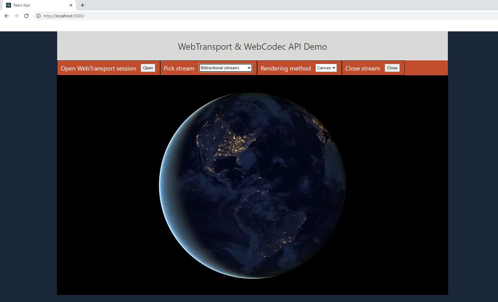

# WebTransport & WebCodec API demo

This is an experimental demo of sending raw h264 frames, decoding and rendering them in the browser, via a simple custom binary protocol, simulating a live stream scenario.

The server is implemented in Golang using the [webtransport-go](https://github.com/adriancable/webtransport-go) library and the browser demo page is in React.

This demo uses [WebTransport](https://web.dev/webtransport/) and [WebCodec](https://developer.mozilla.org/en-US/docs/Web/API/WebCodecs_API)  APIs.

<p align="center">
    
</p>


**Disclaimer**: Due to WebTransport running over HTTP3/QUIC, the demo requires TLS authentication. 
You will have to use a certificate issued by a known certificate authority, or alternatively, generate a self-signed certificate and use [Chromium](https://www.chromium.org/chromium-projects/) to run the demo locally.

## System Prerequisites
- Golang
- React
- npm, yarn
- FFMpeg
- Chrome/Edge
- Chromium (optional)

## Demo explanation

- Pre-run scripts take an input mp4 file and extracts all h264 frames as separate files, using FFMpeg. A few sample videos are provided in `data/` directory
- The server loads all raw frames from disk into memory, and loops the video whenever a client connects
-  A 14 byte binary header is added, with aditional information about the frame, before serialization. The header contains (`type`: [keyframe, delta], `timestamp`: <in_microseconds>), as required by `EncodedVideoCunk`([docs](https://developer.mozilla.org/en-US/docs/Web/API/EncodedVideoChunk))
```Golang
type FrameType uint16

const (
	Key   FrameType = 0x0001
	Delta FrameType = 0xffff
)

type FrameHeader struct {
	Type      FrameType
	Timestamp uint64 // in microseconds
	Size      uint32
}
```
- You can pick uniderictional/bidirectional stream mode
- You can pick rendering method (only HTML `Canvas` supported as of now)
- The server generates timestamps and assumes `30` fps by default

### Running with Chromium

- Generate a certificate and a private key:
```bash
    openssl req -newkey rsa:2048 -nodes -keyout certificate.key \
                -x509 -out certificate.pem -subj '/CN=Test Certificate' \
                -addext "subjectAltName = DNS:localhost"
```
- Compute the fingerprint of the certificate:
```bash
    openssl x509 -pubkey -noout -in certificate.pem |
                openssl rsa -pubin -outform der |
                openssl dgst -sha256 -binary | base64
```
    The result should be a base64-encoded blob that looks like this:
        "Gi/HIwdiMcPZo2KBjnstF5kQdLI5bPrYJ8i3Vi6Ybck="

-  Pass a flag to Chromium indicating what host and port should be allowed
    to use the self-signed certificate.  For instance, if the host is
    localhost, and the port is 4433, the flag would be:
```bash
    --origin-to-force-quic-on=localhost:4433
```

-  Pass a flag to Chromium indicating which certificate needs to be trusted.
    For the example above, that flag would be:
```bash
    --ignore-certificate-errors-spki-list=Gi/HIwdiMcPZo2KBjnstF5kQdLI5bPrYJ8i3Vi6Ybck=
```
Source: [Google Chrome Samples](https://github.com/GoogleChrome/samples/blob/gh-pages/webtransport/webtransport_server.py)

## Running the demo

First, extract frames from input MP4 file (this only needs to be done once)
```sh
cd data
chmod +x ./extract-frames.sh && ./extract-frames.sh
```

Build & run Golang server
```sh
cd server
go build && \
./webtransport-demo
```

Run React development server

```sh
cd demo-app
yarn start
```

Open `localhost:3000`
